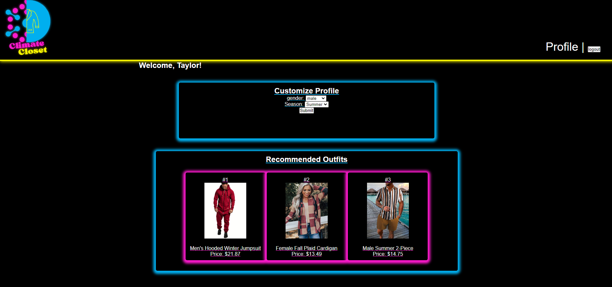

# Climate Closet
## Description

  Climate closet is an application that will give you outfit reccomendations based on the climate. By answering a couple questions and creating a profile you will be greeted with new outfits each day based on the forecast, climate, and season.

## Table of Contents

  - [Installation](#installation)
  - [Usage](#usage)
  - [Dependencies](#dependencies)
  - [Credits](#credits)
  - [License](#license)
  - [Contribution](#contribution)
  - [Questions](#questions)
  
## Dependencies

  macOS,Windows 10,Linux, mySQL, Sequelize, Handlebars, Nodejs, Heroku, Axios, dotenv, ebay-node-api

    
## Installation
  [Deployed App](https://git.heroku.com/climatecloset-app.git)
  [Repository](https://github.com/Gabriel-V75169/Up-For-Debate)
    
## Usage
    
  
    
## Credits
    
  Gabriel Valencia, Rael Wanjala, Gabriel Rinaldi, and  Taylor Rozier
    
## License
    
  MIT 
    
## Contribution
    
Gabriel V. - CSS, Handlebars, Presentation
Taylor R. - customRoutes, user profile js functions
Rael - shoppingRoutes, Product database, Wireframes,Logo, 
Gabriel R - userRoutes, Login/logout functions

    
## Questions

  Contact me for any questions with the following:
  - [Github](Gabriel-V75169, RaelNW, gaberinaldi, and  RozierT)
  - [ jrjr75169@gmail.com, raelnwanjala@gmail.com, gaberinaldi.bio@gmail.com, and  roziertaylor@gmail.com]